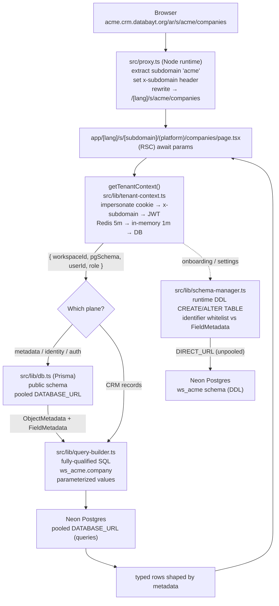

# Architecture: Section — Core (Two-Plane Metadata-Driven CRM)

## Status: PROPOSED

> Scope: the foundational architecture for the CRM — a Twenty (twentyhq/twenty)
> clone rebuilt on the databayt stack (Next.js 16, React 19, Prisma 6, Tailwind 4,
> shadcn/ui, Auth.js v5). Arabic-first (RTL default), multi-tenant
> (subdomain-per-workspace, **schema-per-workspace** data plane), metadata-driven
> (runtime DDL custom objects/fields). This document is the single architectural
> source of truth for Phases 0–6 of
> `~/.claude/plans/here-in-crm-we-typed-hickey.md`. It supersedes §3.1 of the
> companion schema file
> `~/.claude/plans/here-in-crm-we-typed-hickey-agent-a1583746d3149796f.md`
> (the JSON-blob custom-fields compromise) with the full dynamic-schema design.

---

## 1. System Overview

### 1.1 The two planes

The "full dynamic schema like Twenty" decision splits the system into two cleanly
separated planes. This split is the central architectural idea of the whole build.

```
                  host: acme.crm.databayt.org   (or acme.localhost:3000 in dev)
                                    │
        src/proxy.ts (Node runtime) ── extract "acme", set x-subdomain header,
                                       rewrite → /[lang]/s/acme/<path>
                                    │
        getTenantContext()  ── impersonate cookie → x-subdomain → JWT
                               returns { workspaceId, pgSchema, userId, role }
                                    │
   ┌────────────────────────────────┴─────────────────────────────────────────┐
   │  CONTROL PLANE (Prisma, public schema)     DATA PLANE (per-workspace pg schema)
   │  copied near-verbatim from hogwarts         the "metadata engine" (Twenty-faithful)
   ├────────────────────────────────────         ──────────────────────────────────────
   │  Workspace, User, Member, Account           schema "ws_<id>" created at onboarding
   │  ObjectMetadata, FieldMetadata,             tables materialized from FieldMetadata
   │  View, Favorite                             via runtime DDL (CREATE/ALTER TABLE)
   │  Auth.js v5, cross-subdomain cookies        standard objects (company/person/
   │  tenant-context, circuit-breaker,           opportunity/activity) are seeded as
   │  Prisma scope guard                         metadata → identical code path to
   │  src/lib/db.ts (pooled DATABASE_URL)        custom objects
   │                                             src/lib/schema-manager.ts (DIRECT_URL, DDL)
   │                                             src/lib/query-builder.ts (pooled, parameterized)
   └────────────────────────────────────────────────────────────────────────────┘
```

- **Control plane** = identity, tenancy routing, and the _metadata_ describing every
  object/field. Pure Prisma against the `public` schema, copied near-verbatim from
  hogwarts (`schoolId` → `workspaceId`, `School` → `Workspace`). This is where
  multi-tenancy (subdomain → workspace), Auth.js, cross-subdomain cookies, and the
  `ObjectMetadata`/`FieldMetadata` registry live.
- **Data plane** = the actual CRM records. Each workspace gets its **own Postgres
  schema** (`ws_<workspaceId>`); standard and custom objects alike are real tables
  created/altered at runtime by a **metadata engine** using parameterized raw SQL via
  the `pg` driver. Tenant isolation here is **schema-level** (the strongest form),
  resolved from the same subdomain mapping the control plane already computes.

Standard objects being "just seeded metadata" is what makes custom objects nearly
free from Phase 5 onward — the table/kanban/form/detail UI is **generic and
metadata-driven**, so a user-created object renders in every view the instant its
metadata exists.

### 1.2 Request flow (the choke point)



Every data-plane access funnels through `query-builder.ts`, and every DDL through
`schema-manager.ts`. Tenant isolation reduces to a single invariant enforced in two
files: _always pass the resolved `pgSchema`_. There is no second path to the data.

---

## 2. Architecture Decision Records

Each ADR is stated as **Context / Decision / Consequences**. Together they lock the
design before any code is written; the BMAD `implementation-readiness` gate checks
PRD ↔ Architecture ↔ Epics cohesion against this section.

---

### ADR-001: Prisma + Postgres control plane over Twenty's TypeORM/NestJS/GraphQL

**Status:** Accepted

**Context.**
Upstream Twenty is a NestJS monorepo: TypeORM entities, a GraphQL API generated
per-workspace from metadata, and a separate React SPA. The databayt stack is a single
Next.js 16 app: React 19 Server Components, server actions, Prisma 6 as the ORM,
Auth.js v5, Tailwind 4 + shadcn/ui. Every reusable asset we are pulling
(`hogwarts` multi-tenancy, `codebase` UI/atoms/`leads` blueprint, `lab` skeleton) is
Prisma-and-Next-shaped. Adopting TypeORM/NestJS/GraphQL would discard all of it and
fork the team's mental model.

**Decision.**
Implement the **control plane** (identity, tenancy, and the object/field metadata
registry) as **Prisma 6 models in the `public` schema**, copied near-verbatim from
hogwarts. No NestJS, no TypeORM, no GraphQL. The metadata registry
(`ObjectMetadata`, `FieldMetadata`, `View`, `Favorite`) is ordinary Prisma — it is
just data that _describes_ the data plane.

**Consequences.**

- (+) Reuse hogwarts' proven `proxy.ts` / `tenant-context.ts` / `db.ts` /
  `multi-tenant-prisma-adapter.ts` / `auth.ts` / `circuit-breaker.ts` essentially
  unchanged — Phase 1 becomes a rename-and-wire exercise, not a build.
- (+) Prisma migrations (`prisma migrate dev`) version the control plane like any
  databayt project; CI runs `pnpm prisma generate` before typecheck.
- (−) Prisma is schema-first and cannot model _the data plane_ — Prisma's static
  client cannot generate types for tables that do not exist at build time. That is
  exactly why the **data plane is deliberately NOT Prisma** (see ADR-002): Prisma owns
  the control plane only; raw `pg` owns the per-workspace record tables.
- (−) We forgo Twenty's auto-generated GraphQL. Acceptable: ADR-004 makes server
  actions the entire API surface.

---

### ADR-002: Two-plane design — schema-per-workspace data plane + metadata engine + runtime DDL (the core decision)

**Status:** Accepted

**Context.**
Twenty's signature capability is runtime-configurable objects and fields: a user adds
a "Renewal Date" field or an entire "Contract" object at runtime and it instantly
becomes a first-class, queryable, indexable column/table. Two strategies exist:

1. **JSON blob + metadata** (`customValues Json?` on each model + a `CustomFieldDef`
   table) — the companion file's original §3.1 compromise. No DDL, no rebuild, but
   custom fields are unindexed, untyped at the DB level, and can never reach parity
   with standard fields. This was rejected.
2. **Full dynamic schema** — real physical columns/tables created at runtime via DDL,
   the way Twenty actually works. This is the locked decision.

The locked decision is the **full Twenty clone with full dynamic schema**.

**Decision.**
Split the system into two planes:

- **Control plane** (ADR-001): Prisma/`public`, including the `ObjectMetadata` /
  `FieldMetadata` registry.
- **Data plane**: **one Postgres schema per workspace**, named `ws_<workspaceId>`.
  Every object — standard _and_ custom — is a **real table** in that schema, with
  **real columns** for each field. Tables and columns are created and altered at
  runtime by a **metadata engine** (`src/lib/schema-manager.ts`) that translates
  `FieldMetadata` into `CREATE TABLE` / `ALTER TABLE` DDL. Reads/writes go through a
  **dynamic query builder** (`src/lib/query-builder.ts`) that translates
  `(object metadata + filters/sorts/page)` into fully-qualified parameterized SQL.
- **Standard objects are seeded as metadata** (`prisma/seed-metadata.ts`) and
  materialized by the _same_ engine — so custom objects share an identical code path.

Tenant isolation is **schema-level** — the strongest isolation Postgres offers short
of separate databases — resolved from the same subdomain mapping the control plane
already computes.

**Consequences.**

- (+) True Twenty parity: custom fields are indexed, typed, sortable, filterable —
  indistinguishable from standard fields to both the DB and the UI.
- (+) Schema-level isolation: a query against `"ws_acme"."company"` _cannot_ return
  `globex` rows; there is no `workspaceId` predicate to forget. This is the headline
  security property (see §6).
- (+) Generic UI for free: because standard objects are seeded metadata, the
  metadata-driven record UI (ADR-006) renders custom objects with zero new code.
- (−) **This is the highest-risk subsystem.** Runtime DDL + schema-per-workspace is
  hard and unforgiving. Mitigation: Phase 2 builds the _entire_ engine end-to-end
  against **one object (Company)** before generalizing — that vertical slice is the
  go/no-go checkpoint for the whole dynamic-schema bet.
- (−) **Catalog bloat at very high tenant counts.** Postgres/Neon get heavy past tens
  of thousands of tables (one schema × N objects per workspace). Acceptable for the
  clone; documented fallback = row-level `workspaceId` for standard objects + dynamic
  tables for custom only. Revisit if tenant count explodes.
- (−) Type safety across the dynamic boundary: rows are `Record<string, unknown>`
  shaped by metadata, not Prisma types. Mitigation: a runtime validator at the
  query-builder boundary + per-object TS types generated from metadata where feasible;
  keep the dynamic surface behind the query-builder choke point.
- (−) Two connection modes required — see ADR-008 (DDL on `DIRECT_URL`, queries on
  pooled `DATABASE_URL`).

---

### ADR-003: Subdomain routing + tenant-context resolution (copied from hogwarts)

**Status:** Accepted

**Context.**
Multi-tenancy is subdomain-per-workspace: `acme.crm.databayt.org` (prod) /
`acme.localhost:3000` (dev). hogwarts already solves the entire chain — subdomain
extraction, URL rewrite, a circuit-broken two-tier-cached tenant lookup, and a
dev-time Prisma scope guard. Re-deriving this would be waste and risk.

**Decision.**
Copy hogwarts' tenancy chain near-verbatim, renaming `schoolId` → `workspaceId`,
`School` → `Workspace`:

| Concern                                    | Source (hogwarts)                        | Target (crm)                             |
| ------------------------------------------ | ---------------------------------------- | ---------------------------------------- |
| Subdomain detect + rewrite                 | `src/proxy.ts`                           | `src/proxy.ts`                           |
| Tenant resolution + 2-tier cache + breaker | `src/lib/tenant-context.ts`              | `src/lib/tenant-context.ts`              |
| Prisma singleton + dev scope guard         | `src/lib/db.ts`                          | `src/lib/db.ts`                          |
| Multi-tenant Auth.js adapter               | `src/lib/multi-tenant-prisma-adapter.ts` | `src/lib/multi-tenant-prisma-adapter.ts` |
| Auth core + cookies + redirect             | `src/auth.ts`                            | `src/lib/auth.ts`                        |
| Providers                                  | `src/auth.config.ts`                     | `src/lib/auth.config.ts`                 |
| Circuit breaker                            | `src/lib/circuit-breaker.ts`             | `src/lib/circuit-breaker.ts`             |

`proxy.ts` runs in the **Node runtime** (not Edge `middleware.ts`) — required because
tenant resolution touches the DB and the metadata engine. The host
`acme.crm.databayt.org` → extract `acme` → set `x-subdomain: acme` header → rewrite
to `/[lang]/s/acme/<path>`. Main domain (`crm.databayt.org`, bare `localhost:3000`)
serves marketing + global auth + the workspace picker.

`getTenantContext()` resolves in priority order:

1. `impersonate_workspaceId` cookie (platform-admin debugging);
2. `x-subdomain` header → `workspaceId` via cached DB lookup (Redis 5min → in-memory
   1min → DB), which also yields the `pgSchema` name (`ws_<workspaceId>`);
3. `session.user.workspaceId` from the JWT.

It returns `{ workspaceId, pgSchema, userId, role, isPlatformAdmin }`. The `pgSchema`
field is the CRM-specific addition over hogwarts — it is the bridge into the data
plane and is computed once, here.

**Consequences.**

- (+) Phase 1 is wiring, not invention; the cache + circuit breaker that keep tenant
  lookups fast and fail-safe come for free.
- (+) `pgSchema` is resolved in exactly one place; the data plane never re-derives it.
- (−) `proxy.ts` must stay Node-runtime; we lose Edge's geo-proximity for the rewrite
  hop. Acceptable — the DB lookup is cached and circuit-broken.
- (−) Custom domains (`customDomain` on `Workspace`) need a Redis
  `custom-domain:{host} → subdomain` map; fail-open if Redis is absent.

---

### ADR-004: Server actions only — no REST/GraphQL

**Status:** Accepted

**Context.**
Twenty exposes REST + auto-generated GraphQL. The databayt convention (hogwarts,
codebase `leads/`) is **server actions only**: `'use server'` functions, Zod-validated,
tenant-scoped, returning a uniform `ActionResponse<T>`. There is no second consumer of
the API (no mobile app, no third-party integration in MVP scope).

**Decision.**
**Server actions are the entire backend surface.** No REST routes, no GraphQL schema,
no API route handlers for CRM data. Every mutation/query is a server action that:

1. calls `getTenantContext()` first (never trusts a client-sent workspace id);
2. validates input with Zod (for dynamic objects, a Zod schema **generated from
   `FieldMetadata`**);
3. calls `query-builder.*` (data plane) or `db.*` (control plane);
4. `revalidatePath`s the affected route;
5. returns `ActionResponse<T>` (`{ success, data?, error?, fieldErrors? }`).

The generic record CRUD lives in `src/components/platform/record/actions.ts`;
object-specific overrides (e.g. `moveOpportunity`) live in their feature block.

**Consequences.**

- (+) One auth/tenant/validation pattern everywhere; the `leads/action.ts` blueprint
  ports directly.
- (+) No API surface to secure separately — tenant scoping happens inside the choke
  point (query-builder), and every action passes through `getTenantContext()`.
- (−) No external API for third parties in MVP. Documented as post-MVP; a thin REST
  facade over the query-builder can be added later without touching the data model.
- (−) Server actions are POST-only and not cacheable like GET routes — fine for a CRM
  whose reads are RSC-rendered server-side anyway.

---

### ADR-005: Auth.js v5 JWT + cross-subdomain cookies

**Status:** Accepted

**Context.**
Users authenticate on the main domain and then operate on a workspace subdomain
(`acme.crm.databayt.org`). The session must survive the hop across subdomains, and the
Node-runtime proxy must be able to read role/tenant cheaply. Providers are **Google
OAuth + email/password credentials**. RBAC is flat `MemberRole`
(OWNER/ADMIN/MEMBER/VIEWER) for MVP.

**Decision.**
Auth.js v5 with the **JWT session strategy** and a **multi-tenant Prisma adapter**
(copied from hogwarts). Auth routes are **global** — `app/[lang]/(auth)/{login,
register,join}` — never under `s/[subdomain]/`. Cookie configuration:

- all Auth.js cookies set `domain: '.crm.databayt.org'` in prod / `undefined` in dev,
  `sameSite: 'lax'`, `httpOnly: true` — so the session is valid on every subdomain;
- a lightweight non-`httpOnly` `authjs.role` cookie is synced for any Edge consumer
  that can't decode the JWE;
- the JWT callback populates `token.workspaceId`; a **forced refresh on
  `trigger === 'update'`** picks up the new workspace immediately after `/join`
  creates it.

`/join` (onboarding) creates the `Workspace` + `Member`, **then provisions the
workspace's Postgres schema** (`schema-manager.createWorkspaceSchema`) and
**materializes the standard objects** from their seed metadata before redirecting into
the platform.

**Consequences.**

- (+) Single sign-in works across all subdomains; the proxy reads tenant/role from the
  cookie/JWT without a round-trip.
- (+) JWT carries `workspaceId`, so `getTenantContext()` has a third fallback even
  when no subdomain header is present (e.g. on the main domain).
- (−) JWT is not revocable mid-session; flat RBAC means role changes need a session
  refresh. Acceptable for MVP — row-level permission enforcement is post-MVP.
- (−) Onboarding is a multi-step saga (DB write → schema create → DDL materialize →
  JWT refresh). If schema provisioning fails, the `Workspace`/`Member` write must roll
  back (see ADR-008 saga rule) so the user can retry cleanly.

---

### ADR-006: URL-mirror generic, metadata-driven feature blocks

**Status:** Accepted

**Context.**
Because the data plane is metadata-driven, building one bespoke block per object
(companies, people, opportunities, …) — and again per _custom_ object — would defeat
the entire premise. The databayt mirror pattern says routes mirror component
directories; we extend it to a **single generic record system** parameterized by
object metadata.

**Decision.**
Build the platform record UI **once, generically**, in
`src/components/platform/record/`, driven by `ObjectMetadata` + `FieldMetadata`:

| File                | Responsibility                                                                                                                  |
| ------------------- | ------------------------------------------------------------------------------------------------------------------------------- |
| `content.tsx`       | RSC: `getTenantContext()` → load `ObjectMetadata` → `queryBuilder.findMany` → pass rows + metadata to the table                 |
| `record-table.tsx`  | TanStack Table + `nuqs` URL state; columns generated from `FieldMetadata`, per-type cell renderers                              |
| `record-form.tsx`   | RHF + a Zod schema **generated from `FieldMetadata`**; inputs chosen by field `type` (reuse databayt form atoms)                |
| `record-detail.tsx` | left field panel + right activity timeline (port `codebase/leads/detail.tsx`)                                                   |
| `actions.ts`        | `'use server'` CRUD; every call resolves `{ workspaceId, pgSchema }` → `queryBuilder.*` → `revalidatePath`; `ActionResponse<T>` |
| `field-renderers/`  | per-type read/write cells (TEXT, NUMBER, BOOLEAN, DATE, SELECT, MULTI_SELECT, RELATION, CURRENCY, EMAIL, PHONE, URL, RATING)    |

Routes mirror via a generic segment:
`app/[lang]/s/[subdomain]/(platform)/<object>/page.tsx` ⇄
`src/components/platform/record/` (object-specific blocks under
`components/platform/<object>/` only when an object needs custom behaviour, e.g.
`pipeline/`). The dictionary is threaded Content → Table → Form; object/field labels
are bilingual in metadata (`labelSingular`/`labelPlural`).

**Consequences.**

- (+) A user-created object renders in table/form/detail the instant its metadata
  exists — the Phase 5 "custom objects" feature is **mostly free**.
- (+) One place to fix a per-type rendering bug; one place to add a new field type.
- (−) The generic UI must be exhaustively type-driven; an unhandled `FieldMetadata.type`
  must degrade gracefully (fallback to text). The field-type set is a closed enum
  (ADR-008 `type→pgType` map) so this is bounded.
- (−) Per-object polish (e.g. opportunity Kanban) needs an escape hatch — provided by
  object-specific blocks layered over the generic system.

---

### ADR-007: Pipeline Kanban via @dnd-kit

**Status:** Accepted

**Context.**
The opportunity pipeline Kanban is Twenty's signature view — drag a card across stage
columns. `react-beautiful-dnd` is deprecated and not React-19/RSC-friendly. `@dnd-kit`
is modern, accessible, and headless.

**Decision.**
Use **`@dnd-kit/core` + `@dnd-kit/sortable`** for the pipeline board
(`src/components/platform/pipeline/`). Columns are `Stage` rows (ordered by
`position`), cards are `opportunity` rows from the data plane. Drop fires a
`moveOpportunity({ id, toStageId, position })` server action that updates `stageId` +
`position` **in a single transaction** through the query-builder, then
`revalidatePath`s the board. Directional affordances use `rtl:rotate-180` so the board
reads correctly in Arabic.

**Consequences.**

- (+) Accessible (keyboard DnD), React-19-compatible, headless so it inherits our
  Tailwind/RTL styling.
- (+) The move is atomic — no half-moved cards on failure.
- (−) Optimistic reordering needs careful reconciliation with the server's authoritative
  `position`; mitigate with `useOptimistic` + revalidation.
- (−) Stages/opportunities are data-plane rows, so the board reads them through the
  query-builder, not Prisma — the Kanban must consume metadata-shaped rows like every
  other view.

---

### ADR-008: DDL safety — identifier whitelisting, parameterized values, DIRECT_URL, no search_path

**Status:** Accepted

**Context.**
Runtime DDL is the single most dangerous thing this system does. SQL identifiers
(schema/table/column names) **cannot** be bound as parameters — they must be
interpolated into the SQL string, which is a classic injection vector. Neon's pooled
connections also make session state (`SET search_path`) unsafe, because a pooled
connection may carry state into another tenant's request.

**Decision.**
Four non-negotiable safety rules, enforced in `schema-manager.ts` and
`query-builder.ts`:

1. **Identifier whitelisting against `FieldMetadata`.** Every schema/table/column name
   that reaches a DDL or query string is first validated against the control-plane
   registry — a name is legal only if a corresponding `ObjectMetadata` /
   `FieldMetadata` row exists (and matches `^[a-z_][a-z0-9_]*$`). Names are then quoted
   via `pg`'s identifier escaping. There is no path from raw user input to an
   identifier; users supply _labels_, the engine derives `snake_case` names and stores
   them in metadata, and only metadata-sourced names are ever interpolated.
2. **Parameterized values, always.** Every value is bound (`$1`, `$2`, …) — in DDL
   defaults _and_ in every query-builder read/write. No value is ever string-concatenated.
3. **Column types from a fixed `type→pgType` map.** Field `type` (a closed enum) maps
   to a fixed Postgres type (see §4.2). DDL never accepts a free-form type string.
4. **`DIRECT_URL` for DDL, no `search_path`.** All DDL runs over the **unpooled
   `DIRECT_URL`**; all queries run over the pooled `DATABASE_URL`. The query-builder
   emits **fully-qualified** names (`"ws_acme"."company"`) and **never** issues
   `SET search_path` — so a pooled connection carries no tenant state between requests.

DDL runs inside a transaction; on failure the transaction rolls back **and** the
control-plane metadata write is reverted (a **saga**: write metadata → run DDL →
commit both, or revert metadata if DDL fails). This keeps the metadata registry and
the physical schema in lockstep.

**Consequences.**

- (+) Injection is structurally impossible — identifiers come only from a validated
  whitelist, values are always bound.
- (+) No cross-tenant leakage via pooled-connection session state.
- (+) Metadata and physical schema can never silently diverge (saga rollback).
- (−) Two connection URLs to manage in the central `.env` (`DATABASE_URL` pooled,
  `DIRECT_URL` unpooled). Documented; mirrors the databayt Neon standard.
- (−) DDL is serialized per workspace under a transaction — concurrent
  add-field/add-object operations on the same workspace are queued. Acceptable; schema
  changes are rare relative to record CRUD.

---

## 3. Control-plane Prisma schema

Modular schema like hogwarts: `generator` + `datasource` in `prisma/schema.prisma`,
one file per concern under `prisma/models/`. All models live in the `public` schema.
`datasource` declares both `url = env("DATABASE_URL")` (pooled) and
`directUrl = env("DIRECT_URL")` (unpooled — used by Prisma migrate **and** by the
metadata engine's `pg` pool for DDL).

### 3.1 `prisma/models/workspace.prisma`

```prisma
model Workspace {
  id              String   @id @default(cuid())
  name            String
  subdomain       String   @unique          // acme → acme.crm.databayt.org
  customDomain    String?  @unique
  pgSchema        String   @unique           // "ws_<id>" — the data-plane schema name
  logoUrl         String?
  defaultLocale   String   @default("ar")    // "ar" | "en"
  defaultCurrency String   @default("USD")
  planType        String   @default("free")
  isActive        Boolean  @default(true)
  createdAt       DateTime @default(now())
  updatedAt       DateTime @updatedAt

  members         Member[]
  objects         ObjectMetadata[]
  fields          FieldMetadata[]
  views           View[]
  favorites       Favorite[]

  @@map("workspaces")
}
```

### 3.2 `prisma/models/auth.prisma`

```prisma
enum GlobalRole { PLATFORM_ADMIN USER }          // platform-level identity
enum MemberRole { OWNER ADMIN MEMBER VIEWER }     // workspace-level (flat for MVP)

model User {                                      // platform identity (cross-workspace)
  id            String     @id @default(cuid())
  email         String?    @unique
  emailVerified DateTime?
  name          String?
  image         String?
  password      String?                           // bcrypt — credentials provider
  role          GlobalRole @default(USER)
  accounts      Account[]
  members       Member[]
  createdAt     DateTime   @default(now())

  @@map("users")
}

model Member {                                    // user ↔ workspace join (the membership)
  id          String     @id @default(cuid())
  userId      String
  workspaceId String
  role        MemberRole @default(MEMBER)
  user        User       @relation(fields: [userId], references: [id], onDelete: Cascade)
  workspace   Workspace  @relation(fields: [workspaceId], references: [id], onDelete: Cascade)

  @@unique([userId, workspaceId])
  @@index([workspaceId])
  @@map("members")
}

model Account {                                   // OAuth (Google) — Auth.js adapter shape
  id                String  @id @default(cuid())
  userId            String
  type              String
  provider          String
  providerAccountId String
  refresh_token     String? @db.Text
  access_token      String? @db.Text
  expires_at        Int?
  token_type        String?
  scope             String?
  id_token          String? @db.Text
  session_state     String?
  user              User    @relation(fields: [userId], references: [id], onDelete: Cascade)

  @@unique([provider, providerAccountId])
  @@map("accounts")
}

model VerificationToken {
  identifier String
  token      String   @unique
  expires    DateTime
  @@unique([identifier, token])
  @@map("verification_tokens")
}

model PasswordResetToken {
  id      String   @id @default(cuid())
  email   String
  token   String   @unique
  expires DateTime
  @@unique([email, token])
  @@map("password_reset_tokens")
}
```

> JWT session strategy means no `Session` table is required.

### 3.3 `prisma/models/metadata.prisma` — the registry (the heart of the control plane)

```prisma
model ObjectMetadata {
  id            String  @id @default(cuid())
  workspaceId   String
  nameSingular  String                 // "company"
  namePlural    String                 // "companies"
  labelSingular String                 // bilingual label (ar/en variants in Json on field labels)
  labelPlural   String
  icon          String?
  isCustom      Boolean @default(false) // standard (seeded) vs user-created
  isActive      Boolean @default(true)
  tableName     String                  // physical table in ws_<id> schema (snake_case, validated)

  workspace     Workspace       @relation(fields: [workspaceId], references: [id], onDelete: Cascade)
  fields        FieldMetadata[]
  views         View[]

  @@unique([workspaceId, nameSingular])
  @@index([workspaceId])
  @@map("object_metadata")
}

model FieldMetadata {
  id           String  @id @default(cuid())
  workspaceId  String
  objectId     String
  name         String                 // column name, snake_case, validated (whitelist source)
  label        String
  type         String                 // TEXT|NUMBER|BOOLEAN|DATE|DATETIME|SELECT|MULTI_SELECT|
                                       // RELATION|CURRENCY|EMAIL|PHONE|URL|RATING
  isCustom     Boolean @default(false)
  isNullable   Boolean @default(true)
  isSystem     Boolean @default(false) // id / created_at / updated_at
  defaultValue String?
  options      Json?                   // SELECT options, RELATION target object, currency code…
  position     Int

  workspace    Workspace      @relation(fields: [workspaceId], references: [id], onDelete: Cascade)
  object       ObjectMetadata @relation(fields: [objectId], references: [id], onDelete: Cascade)

  @@unique([objectId, name])
  @@index([workspaceId])
  @@map("field_metadata")
}

model View {                            // saved table/kanban config
  id            String  @id @default(cuid())
  workspaceId   String
  objectId      String
  name          String
  viewType      String                 // "table" | "kanban"
  filters       Json?                  // [{ field, op, value }]
  sorts         Json?                  // [{ field, dir }]
  visibleFields Json?                  // ordered field names
  groupBy       String?                // kanban grouping field (e.g. stage)
  isDefault     Boolean @default(false)

  workspace     Workspace      @relation(fields: [workspaceId], references: [id], onDelete: Cascade)
  object        ObjectMetadata @relation(fields: [objectId], references: [id], onDelete: Cascade)

  @@index([workspaceId, objectId])
  @@map("views")
}

model Favorite {
  id          String   @id @default(cuid())
  workspaceId String
  userId      String                   // the Member's user
  objectName  String                   // object favorited
  recordId    String?                  // optional: a specific record in the data plane
  position    Int      @default(0)
  createdAt   DateTime @default(now())

  workspace   Workspace @relation(fields: [workspaceId], references: [id], onDelete: Cascade)

  @@index([workspaceId, userId])
  @@map("favorites")
}
```

> Note: `View` and `Favorite` carry `objectName`/`recordId` as plain strings, **not**
> Prisma relations to data-plane rows — the data plane is outside Prisma's reach by
> design (ADR-002). The query-builder resolves them at read time.

---

## 4. Metadata-engine component design

Three pure modules, each behind a hard boundary, all unit-tested (§7). They are the
only code that touches the data plane.

### 4.1 `src/lib/schema-manager.ts` — runtime DDL

Uses a `pg` `Pool` over **`DIRECT_URL`** (unpooled). Public surface:

| Function                             | DDL emitted                                                                                                                                                                                                | Notes                                    |
| ------------------------------------ | ---------------------------------------------------------------------------------------------------------------------------------------------------------------------------------------------------------- | ---------------------------------------- |
| `createWorkspaceSchema(workspaceId)` | `CREATE SCHEMA IF NOT EXISTS "ws_<id>"`                                                                                                                                                                    | called by `/join` onboarding             |
| `dropWorkspaceSchema(workspaceId)`   | `DROP SCHEMA "ws_<id>" CASCADE`                                                                                                                                                                            | workspace deletion only                  |
| `materializeObject(objectMeta)`      | `CREATE TABLE "ws_<id>"."<table>" (id uuid pk default gen_random_uuid(), created_at timestamptz default now(), updated_at timestamptz default now(), deleted_at timestamptz, …columns from FieldMetadata)` | system columns always present            |
| `addField(fieldMeta)`                | `ALTER TABLE … ADD COLUMN "<name>" <pgType> [NOT NULL] [DEFAULT $1]`                                                                                                                                       | type from §4.2 map                       |
| `alterField(fieldMeta)`              | `ALTER TABLE … ALTER COLUMN …`                                                                                                                                                                             | widening/nullability only (no narrowing) |
| `dropField(fieldMeta)`               | `ALTER TABLE … DROP COLUMN "<name>"`                                                                                                                                                                       | soft-checks for RELATION dependents      |

**Invariants (ADR-008):** every identifier validated against `FieldMetadata` +
quoted; types from the fixed map; defaults parameterized; each call wrapped in a
transaction; **saga** with the control-plane write (revert metadata on DDL failure).
RELATION fields create a real foreign-key column (`<name>_id uuid`) plus, where the
target is in the same workspace schema, a deferred FK constraint.

### 4.2 `type→pgType` map (the closed field-type enum)

| `FieldMetadata.type` | Postgres type        | Input widget    | Notes                                   |
| -------------------- | -------------------- | --------------- | --------------------------------------- |
| `TEXT`               | `text`               | input           |                                         |
| `NUMBER`             | `numeric`            | number input    |                                         |
| `BOOLEAN`            | `boolean`            | switch          |                                         |
| `DATE`               | `date`               | date picker     |                                         |
| `DATETIME`           | `timestamptz`        | datetime picker |                                         |
| `SELECT`             | `text`               | select          | options in `FieldMetadata.options`      |
| `MULTI_SELECT`       | `text[]`             | multi-select    | array column                            |
| `RELATION`           | `uuid` (`<name>_id`) | record lookup   | target object in `options.targetObject` |
| `CURRENCY`           | `numeric(14,2)`      | currency input  | currency code in `options.currency`     |
| `EMAIL`              | `text` (+ `CHECK`)   | email input     |                                         |
| `PHONE`              | `text`               | phone input     |                                         |
| `URL`                | `text`               | url input       |                                         |
| `RATING`             | `smallint`           | rating stars    | 0–5                                     |

This map is the **only** source of Postgres types — DDL never accepts a free-form
type string.

### 4.3 `src/lib/query-builder.ts` — the data-plane choke point

Uses a `pg` `Pool` over **pooled `DATABASE_URL`**. Single entry per operation; every
call takes the resolved `pgSchema` (never re-derives it):

```
findMany({ pgSchema, objectName, filters, sorts, page, pageSize, select })
findById({ pgSchema, objectName, id, select })
create  ({ pgSchema, objectName, values })
update  ({ pgSchema, objectName, id, values })
softDelete({ pgSchema, objectName, id })      // sets deleted_at
count   ({ pgSchema, objectName, filters })
```

- Input `filters`/`sorts`/`select` are validated against the object's `FieldMetadata`
  (unknown field ⇒ reject) — this is where identifier whitelisting bites for reads.
- Output: fully-qualified parameterized SQL against `"ws_<id>"."<table>"`. **Never**
  `SET search_path`.
- `RELATION` fields resolve via `LEFT JOIN` to the target table in the same schema, or
  a batched second lookup for list views.
- Returns typed rows shaped by metadata (`Record<string, unknown>` → runtime-validated
  → per-object TS type where generated). This is the single place to forget tenant
  scope — so it is the single place we **cannot** forget it: `pgSchema` is a required
  argument with no default.

### 4.4 `prisma/seed-metadata.ts` — standard objects as seed metadata

Seeds default `ObjectMetadata` + `FieldMetadata` rows on workspace creation, then calls
`schema-manager.materializeObject` for each — so standard objects flow through the
_exact same_ path as custom ones. Standard set + field shapes follow Twenty:

| Object        | Key fields                                                                                                                                                            |
| ------------- | --------------------------------------------------------------------------------------------------------------------------------------------------------------------- |
| `company`     | name, domain_name, employees, annual_revenue (CURRENCY), address, city, country, linkedin_url, x_url                                                                  |
| `person`      | first_name, last_name, email (EMAIL), phone (PHONE), job_title, linkedin_url, avatar_url, company_id (RELATION→company)                                               |
| `opportunity` | name, amount (CURRENCY), close_date (DATE), stage_id (RELATION→stage), company_id (RELATION→company), owner_id (RELATION→member), position (NUMBER)                   |
| `activity`    | type (SELECT NOTE/TASK/EMAIL/CALL/MEETING), title, body, due_date (DATETIME), task_status (SELECT), + polymorphic target fields (company_id/person_id/opportunity_id) |
| `pipeline`    | name, is_default (BOOLEAN)                                                                                                                                            |
| `stage`       | name, color, position (NUMBER), is_won (BOOLEAN), is_lost (BOOLEAN), pipeline_id (RELATION→pipeline)                                                                  |

**Result: standard and custom objects are indistinguishable to the UI** — the entire
premise of ADR-002 and ADR-006.

---

## 5. Data-plane SQL conventions

- **Fully-qualified table names always:** `"ws_<workspaceId>"."<tableName>"`. No
  unqualified table references, ever — there is no `search_path`.
- **System columns on every table:** `id uuid pk default gen_random_uuid()`,
  `created_at timestamptz default now()`, `updated_at timestamptz default now()`,
  `deleted_at timestamptz null` (soft delete — `count`/`findMany` filter
  `deleted_at IS NULL` by default).
- **Column naming:** `snake_case`, derived by the engine from the field _label_, stored
  in `FieldMetadata.name`, validated `^[a-z_][a-z0-9_]*$`, and whitelisted before any
  interpolation. RELATION fields are `<name>_id uuid`.
- **Types:** only from the §4.2 `type→pgType` map.
- **Values:** always bound parameters (`$1`, `$2`, …).
- **Connections:** queries on pooled `DATABASE_URL`; DDL/migrations on unpooled
  `DIRECT_URL`. Never session state (`SET …`).
- **Indexes:** per-object, a btree on frequently-filtered columns is created at
  `materializeObject` time (e.g. `company(name)`, `opportunity(stage_id, position)`);
  schema-level isolation means no `workspaceId` column or composite-with-tenant index is
  needed in the data plane.

---

## 6. Tenant-isolation enforcement rules

Isolation is layered; each layer is independently sufficient and they compose.

1. **Schema-level (primary, structural).** Data-plane records live in
   `ws_<workspaceId>`. A query against `"ws_acme"."company"` _cannot_ return `globex`
   rows — there is no predicate to forget. This is the strongest guarantee and the
   reason ADR-002 chose schema-per-workspace.
2. **Single resolution point.** `pgSchema` is computed once, in
   `getTenantContext()` (ADR-003), from the subdomain. No other code derives it.
3. **Required-argument enforcement.** `query-builder.*` and `schema-manager.*` take
   `pgSchema` as a **required argument with no default** — a call that omits it does
   not type-check.
4. **Never trust the client.** Server actions resolve tenant context server-side;
   client-sent workspace ids are ignored. `impersonate_workspaceId` is gated to
   `isPlatformAdmin`.
5. **No pooled session state.** No `SET search_path`; fully-qualified names only — so a
   pooled connection can never carry one tenant's schema into another's request
   (ADR-008).
6. **Control-plane scope guard.** For the Prisma side, `src/lib/db.ts` carries
   hogwarts' `TENANT_SCOPED_MODELS` + `$extends` dev guard that logs when a bulk op
   omits `workspaceId` — covers metadata/registry queries.
7. **Onboarding atomicity.** Schema creation + standard-object materialization are part
   of the `/join` saga; a partial provision rolls back so no half-built tenant schema
   is reachable.

---

## 7. Testing strategy

Vitest, **co-located `*.test.ts` beside source** (no `__tests__/`). The dynamic
boundary is the priority target.

### Unit (the pure modules — highest coverage)

- **`schema-manager`**: identifier whitelisting rejects non-metadata names and
  injection attempts; `type→pgType` map is exhaustive over the field enum; DDL strings
  are correctly quoted/fully-qualified; saga reverts metadata on simulated DDL failure.
- **`query-builder`**: filters/sorts/select validated against `FieldMetadata` (unknown
  field rejected); emitted SQL is fully-qualified and parameterized (assert no
  `search_path`, no string-concatenated values); RELATION join shape.
- **`tenant-context`**: resolution priority (impersonate → header → JWT); cache tiers;
  circuit-breaker fail-open; `pgSchema` derivation.
- **Zod-from-metadata**: a `FieldMetadata` set generates the expected validation schema
  per type.
- **action logic**: `ActionResponse<T>` shape; tenant context resolved before any data
  access.

### Integration

- **Onboarding**: `/join` → `Workspace` + `Member` written → `ws_<id>` schema exists →
  standard-object tables materialized; failure path rolls back cleanly.
- **Vertical slice (Phase 2 go/no-go)**: create a Company via action → row appears in
  `"ws_acme"."company"` **only**; query-builder reads it back; a second workspace
  `globex` sees nothing.

### E2E (Playwright, mirror hogwarts `@multi-tenant` / `@auth` tags)

- CRUD + filter/sort across **both locales** (ar RTL, en LTR); RTL snapshot checks.
- **Tenant-isolation E2E**: cross-workspace read returns empty (schema isolation
  proven end-to-end).
- Kanban drag → DB `stage_id`/`position` updated; activity timeline renders
  chronologically.
- Custom object/field created in Settings → new column appears instantly in the table
  view; DDL verified in Neon.

### Verification gates

- `pnpm validate` (typecheck + lint + test + build) before every push; CI mirrors it.
- `/block` audit ≥ 85 on generic record UI before ship.

---

## 8. Migration strategy

Two distinct migration tracks, because there are two planes.

### 8.1 Control plane (Prisma migrations — versioned, additive)

- `prisma migrate dev` against Neon; migrations committed under `prisma/migrations/`
  (not `.vercelignore`d). `prisma generate` runs on `postinstall` and in CI before
  typecheck.
- **Additive-only discipline** for shipped models: add nullable columns / new models;
  never drop or narrow in a single step (expand → migrate data → contract, across
  releases).
- First migration (Phase 1) creates `Workspace`, `User`, `Member`, `Account`,
  `VerificationToken`, `PasswordResetToken`, and the metadata registry
  (`ObjectMetadata`, `FieldMetadata`, `View`, `Favorite`).

### 8.2 Data plane (runtime DDL — per-workspace, metadata-driven)

- There are **no Prisma migrations** for the data plane — it does not exist at build
  time. Its "migrations" are runtime DDL operations driven by metadata changes
  (`addField`/`alterField`/`materializeObject`), each a saga (ADR-008).
- **Schema versioning per workspace**: a `schemaVersion` (or a hash of the object's
  `FieldMetadata`) is tracked so a workspace's physical schema can be reconciled against
  its metadata; a `reconcile(workspaceId)` admin routine can re-apply missing DDL
  idempotently (`ADD COLUMN IF NOT EXISTS`-style guards).
- **Standard-object evolution**: when the _seed_ metadata for a standard object changes
  in a release, a forward routine applies the delta to every existing workspace's schema
  (additive) — gated, batched, and run over `DIRECT_URL`.

### 8.3 Neon mechanics

- Provision via Neon MCP; capture **`DATABASE_URL`** (pooled) and **`DIRECT_URL`**
  (unpooled) into the central `.env`.
- Use a **Neon branch** to rehearse control-plane migrations and data-plane DDL before
  applying to the primary branch; verify with `mcp__Neon__get_database_tables` /
  `run_sql` that `ws_<id>` schemas and standard-object tables exist after onboarding.

---

## 9. Mapping to phases & epics

| Phase                                 | Epic   | Architecture artifacts landed                                                                                    |
| ------------------------------------- | ------ | ---------------------------------------------------------------------------------------------------------------- |
| 0 Scaffold                            | Epic-0 | skeleton, `globals.css`, i18n (default `ar`), copied ui/atom/form/table                                          |
| 1 Auth + Tenant                       | Epic-1 | §3 control-plane schema + first migration; ADR-003/005 copied chain; `/join` saga (ADR-008) provisions `ws_<id>` |
| 2 Metadata engine (Company slice)     | Epic-2 | §4 `schema-manager` + `query-builder` + `seed-metadata`; **go/no-go for ADR-002**                                |
| 3 Generic record UI                   | Epic-3 | ADR-006 `record/` system; Zod-from-metadata; person/opportunity generalized                                      |
| 4 Pipeline + Activities               | Epic-4 | ADR-007 dnd-kit board; polymorphic activity timeline                                                             |
| 5 Custom objects/fields               | Epic-5 | Settings → `schema-manager` DDL → instant render (mostly free per ADR-002/006)                                   |
| 6 Views / Import / Export / Dashboard | Epic-6 | `View`/`Favorite`; CSV import/export; recharts KPIs                                                              |

**Gate:** `implementation-readiness` (PRD ↔ this Architecture ↔ Epics) before any
coding; Phase 2's vertical slice is the architectural go/no-go checkpoint for the whole
dynamic-schema bet.
