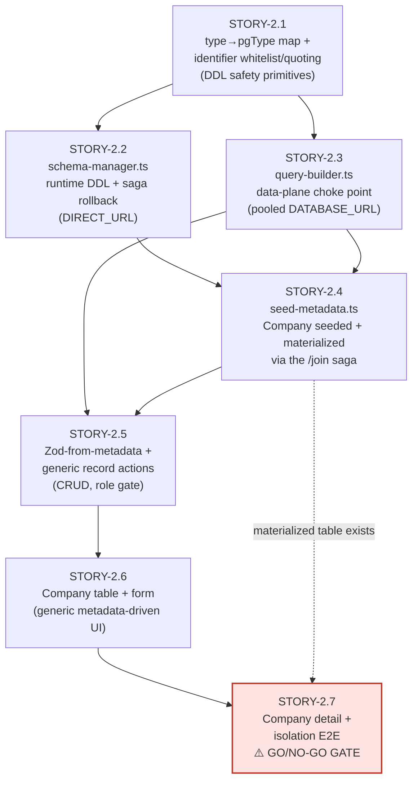

# Story Breakdown: Epic-2 — Metadata Engine (Company Vertical Slice)

## Status: PROPOSED — ⚠️ HIGHEST RISK / GO-NO-GO EPIC

> **Phase 2** of `~/.claude/plans/here-in-crm-we-typed-hickey.md`. Covers PRD
> **FR-B1, FR-B4, FR-C1–C4 (Company only)** and ADR-002/006/008. This is the
> **central architectural bet** of the whole build: runtime DDL + schema-per-workspace
> behind a single query-builder choke point. Per the master plan and ADR-002, build the
> **entire engine end-to-end against one object (Company) before generalizing** — this
> vertical slice is the explicit **go/no-go checkpoint** for the dynamic-schema decision.
> Epic-3 onward only proceeds if this epic's exit criteria are met.

---

## Epic Goal

Company is **fully usable end-to-end** through the generic metadata-driven path:
seeded as `ObjectMetadata`/`FieldMetadata`, materialized into a real
`"ws_<id>"."company"` table via runtime DDL, CRUD'd through the `query-builder` choke
point, and rendered in a generic table/form/detail. A created Company row appears in
`"ws_acme"."company"` **only**; switching subdomain returns zero `acme` data — schema
isolation proven in Neon (PRD M2). The metadata engine (`schema-manager` +
`query-builder` + `seed-metadata`) is the reusable foundation every later object
(person, opportunity, custom objects) flows through unchanged.

## Dependencies

- **Upstream:** Epic-1 (control-plane schema, `getTenantContext()` with `pgSchema`,
  `/join` saga + `schema-manager` stubs, the `ObjectMetadata`/`FieldMetadata` registry).
- **External:** Neon `DIRECT_URL` (DDL) + pooled `DATABASE_URL` (queries) in `.env`;
  a Neon branch to rehearse DDL.
- **Downstream:** Epic-3 (generic record UI generalizes the Company slice to
  person/opportunity), Epic-4 (pipeline/activities read through the query-builder),
  Epic-5 (custom objects reuse `schema-manager` materialize/addField verbatim).

---

## STORY-2.1: `type→pgType` map + identifier whitelist + DDL-safety primitives

**As a** developer
**I want** the closed field-type map and the identifier-whitelisting/quoting utilities
**So that** every DDL and query is structurally injection-proof (ADR-008 / S3)

**Acceptance Criteria:**

- Given the field-type enum, when inspected, then `TEXT|NUMBER|BOOLEAN|DATE|DATETIME|
SELECT|MULTI_SELECT|RELATION|CURRENCY|EMAIL|PHONE|URL|RATING` each map to a fixed
  Postgres type per architecture §4.2 (e.g. `CURRENCY→numeric(14,2)`, `MULTI_SELECT→text[]`,
  `RELATION→uuid`, `RATING→smallint`, `DATETIME→timestamptz`).
- Given an identifier validator, when given a name, then it accepts only `^[a-z_][a-z0-9_]*$`
  **and** only when a matching `ObjectMetadata`/`FieldMetadata` row exists (whitelist), and
  quotes it via `pg` identifier escaping.
- Given an injection attempt (`"; DROP TABLE …`, mixed case, a name absent from metadata),
  when validated, then it is rejected before reaching any SQL string.
- Given the map, when a free-form type string is supplied, then it is rejected — DDL never
  accepts a type outside the fixed map.
- Given `type-map.test.ts`/`identifiers.test.ts`, when run, then the map is exhaustive over
  the enum and injection cases are rejected.

**Files to change:**

| File                                   | Change                                                       |
| -------------------------------------- | ------------------------------------------------------------ |
| `src/lib/metadata/types.ts`            | `FieldType` closed enum; `ObjectMeta`/`FieldMeta` TS types   |
| `src/lib/metadata/type-map.ts`         | `type→pgType` map (§4.2); input-widget map                   |
| `src/lib/metadata/identifiers.ts`      | `assertValidName`, `quoteIdent`, whitelist check vs metadata |
| `src/lib/metadata/type-map.test.ts`    | Exhaustiveness over enum                                     |
| `src/lib/metadata/identifiers.test.ts` | Whitelist + injection rejection                              |

**Estimate:** 3-4 hours

---

## STORY-2.2: `schema-manager.ts` — runtime DDL with saga rollback

**As a** developer
**I want** the schema manager that creates/alters real tables and columns at runtime
**So that** objects materialize from metadata over `DIRECT_URL` with transactional saga
rollback (ADR-008 / S4)

**Acceptance Criteria:**

- Given a `pg` `Pool` over **`DIRECT_URL`**, when `materializeObject(objectMeta)` runs,
  then it emits `CREATE TABLE "ws_<id>"."<table>" (id uuid pk default gen_random_uuid(),
created_at timestamptz default now(), updated_at timestamptz default now(), deleted_at
timestamptz, …columns from FieldMetadata)` with system columns always present.
- Given each field, when its column is built, then its Postgres type comes from the §4.2
  map, identifiers are whitelisted + quoted, and defaults are parameterized (`$1`).
- Given `addField(fieldMeta)`, when run, then `ALTER TABLE … ADD COLUMN "<name>" <pgType>
[NOT NULL] [DEFAULT $1]`; `dropField` → `DROP COLUMN`; `alterField` → widening/nullability
  only (no narrowing).
- Given a `RELATION` field, when materialized, then a `<name>_id uuid` column is created
  (plus a deferred FK to the same-schema target where applicable).
- Given a simulated DDL failure, when the call runs, then the transaction rolls back **and**
  the paired control-plane metadata write is reverted (saga) — metadata and physical schema
  never diverge.
- Given `materializeObject` at `company` materialization time, when run, then a btree index
  is created on frequently-filtered columns (e.g. `company(name)`).

**Files to change:**

| File                             | Change                                                                                                                           |
| -------------------------------- | -------------------------------------------------------------------------------------------------------------------------------- |
| `src/lib/schema-manager.ts`      | Complete the Epic-1 stubs: `materializeObject`, `addField`, `alterField`, `dropField`; `pg` Pool over `DIRECT_URL`; saga wrapper |
| `src/lib/schema-manager.test.ts` | Quoting/fully-qualified SQL; saga reverts metadata on simulated DDL failure; system columns present                              |

**Estimate:** 5-7 hours

---

## STORY-2.3: `query-builder.ts` — the data-plane choke point

**As a** developer
**I want** a single query builder that all data-plane reads/writes pass through
**So that** tenant isolation and field whitelisting are enforced in exactly one place
(FR-B4 / S1 / S3)

**Acceptance Criteria:**

- Given a `pg` `Pool` over **pooled `DATABASE_URL`**, when any op runs, then `pgSchema` is
  a **required argument with no default** — a call omitting it does not type-check.
- Given `findMany / findById / create / update / softDelete / count`, when called, then each
  emits fully-qualified parameterized SQL against `"ws_<id>"."<table>"`, **never** issues
  `SET search_path`, and binds all values (`$1`, `$2`, …).
- Given `filters`/`sorts`/`select`, when supplied, then each field is validated against the
  object's `FieldMetadata` (unknown field ⇒ reject) before any SQL is built.
- Given `softDelete`, when called, then it sets `deleted_at`; `findMany`/`count` filter
  `deleted_at IS NULL` by default.
- Given a `RELATION` field in `select`, when read, then it resolves via `LEFT JOIN` to the
  same-schema target (or a batched lookup for list views) — no N+1.
- Given `query-builder.test.ts`, when run, then it asserts no `search_path`, no
  string-concatenated values, unknown-field rejection, and the RELATION join shape.

**Files to change:**

| File                            | Change                                                                                                                                           |
| ------------------------------- | ------------------------------------------------------------------------------------------------------------------------------------------------ |
| `src/lib/query-builder.ts`      | `findMany/findById/create/update/softDelete/count`; required `pgSchema`; fully-qualified parameterized SQL; field whitelist; RELATION join/batch |
| `src/lib/query-builder.test.ts` | No `search_path`, parameterization, whitelist rejection, RELATION shape                                                                          |

**Estimate:** 5-7 hours

---

## STORY-2.4: `seed-metadata.ts` — Company seeded + materialized on `/join`

**As a** workspace
**I want** Company defined as seed metadata and materialized like a custom object
**So that** standard and custom objects share one code path (FR-B1 / ADR-002)

**Acceptance Criteria:**

- Given a new workspace, when `/join` onboarding completes, then `ObjectMetadata`
  (`company`/`companies`, `isCustom=false`) and its `FieldMetadata` rows exist, and the
  table `"ws_<id>"."company"` exists with system columns + Twenty-shaped fields
  (`name`, `domain_name`, `employees NUMBER`, `annual_revenue CURRENCY`, `address`,
  `city`, `country`, `linkedin_url`, `x_url`).
- Given each field type, when materialized, then its column type comes from the §4.2 map
  (verified in Neon via `mcp__Neon__get_database_tables`).
- Given the onboarding saga (Epic-1), when seed+materialize runs, then a DDL failure
  rolls back both the metadata and the schema (no half-built `company`).
- Given the seed is idempotent, when re-run, then it does not duplicate metadata or
  re-create existing tables.
- (Note: `person`, `opportunity`, `activity`, `pipeline`, `stage` seed shapes are
  **defined here too** but only `company` is exercised end-to-end this epic; the rest are
  materialized for Epic-3/4 to consume.)

**Files to change:**

| File                                  | Change                                                                        |
| ------------------------------------- | ----------------------------------------------------------------------------- |
| `prisma/seed-metadata.ts`             | Full standard-object seed shapes (architecture §4.4); `company` exercised E2E |
| `src/components/auth/join-actions.ts` | Wire seed+`materializeObject` for all standard objects into the saga          |
| `prisma/seed-metadata.test.ts`        | `company` field set + idempotency                                             |

**Estimate:** 3-4 hours

---

## STORY-2.5: Zod-from-metadata + generic record server actions (Company)

**As a** sales user
**I want** Company CRUD actions that validate from metadata and route through the builder
**So that** create/update/delete is tenant-safe and field-shape-correct (FR-C2/C3/C4)

**Acceptance Criteria:**

- Given a `FieldMetadata` set, when `buildZodSchema(fields)` runs, then it generates a Zod
  schema with per-type rules (required if `!isNullable`, EMAIL/URL/PHONE format,
  NUMBER/RATING ranges, SELECT enum from `options`).
- Given the create action, when called, then it begins with
  `const { workspaceId, pgSchema, role } = await getTenantContext()`, validates with the
  generated schema, role-gates (VIEWER rejected on mutations per the PRD matrix), calls
  `queryBuilder.create`, `revalidatePath`s, and returns `ActionResponse<T>`.
- Given `update`, when called, then only changed columns are patched via the builder.
- Given `softDelete`, when called by a VIEWER, then the role gate rejects it; otherwise
  `deleted_at` is set and the row leaves default lists.
- Given a client-sent workspace id, when an action runs, then it is ignored — context is
  resolved server-side (S2).

**Files to change:**

| File                                             | Change                                                                                                                   |
| ------------------------------------------------ | ------------------------------------------------------------------------------------------------------------------------ |
| `src/lib/metadata/zod-from-metadata.ts`          | `buildZodSchema(fields)` per-type                                                                                        |
| `src/lib/metadata/zod-from-metadata.test.ts`     | Per-type schema generation                                                                                               |
| `src/components/platform/record/actions.ts`      | Generic `'use server'` CRUD; `getTenantContext()` → role gate → `queryBuilder.*` → `revalidatePath`; `ActionResponse<T>` |
| `src/components/platform/record/actions.test.ts` | Context-first, role gate, response shape                                                                                 |

**Estimate:** 4-5 hours

---

## STORY-2.6: Company table + form (generic, metadata-driven)

**As a** sales user
**I want** a paginated/sortable/filterable Company table and a create form
**So that** I can browse and add companies through the generic UI (FR-C1 / FR-C2)

**Acceptance Criteria:**

- Given `/ar/companies`, when loaded, then `content.tsx` (RSC) calls `getTenantContext()`,
  loads `ObjectMetadata` for `company`, calls `queryBuilder.findMany`, and passes rows +
  metadata to `record-table.tsx`.
- Given the table, when rendered, then columns are generated from `FieldMetadata` with
  per-type cell renderers, and pagination/sort/filter resolve server-side via the builder.
- Given locale `ar`, when the table renders, then headers use Arabic labels from metadata,
  the layout is RTL, and dates/numbers/currency format via `Intl` for `ar`.
- Given "New", when clicked, then `record-form.tsx` opens a Modal with RHF inputs chosen
  by field type from the Zod-from-metadata schema; valid submit inserts a row and the
  table revalidates; invalid submit shows field-level localized errors.
- Given a 50-field/25-row page on Neon pooled, when loaded, then interactive in < 1.5 s
  p95 (M4).

**Files to change:**

| File                                                         | Change                                                                           |
| ------------------------------------------------------------ | -------------------------------------------------------------------------------- |
| `src/app/[lang]/s/[subdomain]/(platform)/companies/page.tsx` | RSC route → `record/content.tsx` for `company`                                   |
| `src/components/platform/record/content.tsx`                 | RSC fetch (metadata + rows)                                                      |
| `src/components/platform/record/record-table.tsx`            | TanStack Table + nuqs; columns from `FieldMetadata`                              |
| `src/components/platform/record/record-form.tsx`             | RHF + Zod-from-metadata; inputs by type; Modal                                   |
| `src/components/platform/record/field-renderers/*`           | Per-type read/write cells (TEXT/NUMBER/CURRENCY/EMAIL/URL/PHONE/SELECT to start) |
| `src/components/table/*`                                     | Copy `codebase` DataTable + `use-data-table.ts`                                  |
| `src/dictionaries/{ar,en}/company.json`                      | Company labels/toasts                                                            |

**Estimate:** 5-6 hours

---

## STORY-2.7: Company detail + isolation E2E (the go/no-go gate)

**As a** sales user / developer
**I want** a Company detail page and an end-to-end isolation proof
**So that** the vertical slice is complete and the dynamic-schema bet is validated (M2)

**Acceptance Criteria:**

- Given a Company detail route, when opened, then `record-detail.tsx` shows a left field
  panel (per-type renderers) with editable fields; saving patches only changed columns via
  the builder. (The right-hand activity timeline lands in Epic-4; a placeholder slot is
  reserved.)
- Given a created Company on `acme`, when verified in Neon (`mcp__Neon__run_sql`), then the
  row exists in `"ws_acme"."company"` **only**.
- Given workspace `globex`, when it queries `company`, then it returns zero `acme` rows —
  schema isolation proven end-to-end (M2).
- Given the Playwright E2E (mirror hogwarts `@multi-tenant`), when run, then Company CRUD +
  filter/sort pass in **both** `ar` (RTL) and `en` (LTR), and the cross-workspace read
  returns empty.
- Given `/block` audit on `record/`, when run, then score ≥ 85; `pnpm validate` green.

**Files to change:**

| File                                                              | Change                                                                             |
| ----------------------------------------------------------------- | ---------------------------------------------------------------------------------- |
| `src/app/[lang]/s/[subdomain]/(platform)/companies/[id]/page.tsx` | RSC detail route                                                                   |
| `src/components/platform/record/record-detail.tsx`                | Field panel + timeline placeholder; inline edit (port `codebase/leads/detail.tsx`) |
| `src/components/platform/record/integration.test.ts`              | Create→read-back in `ws_acme.company`; `globex` sees nothing                       |
| `e2e/company.spec.ts`                                             | Playwright `@multi-tenant`: CRUD + filter/sort, ar/en, isolation empty             |

**Estimate:** 4-5 hours

---

## Summary

| Story                                           | Files         | Estimate    | Priority      |
| ----------------------------------------------- | ------------- | ----------- | ------------- |
| STORY-2.1 type-map + identifier whitelist       | 5             | 3-4h        | P0 (blocking) |
| STORY-2.2 schema-manager (DDL + saga)           | 2             | 5-7h        | P0 (blocking) |
| STORY-2.3 query-builder (choke point)           | 2             | 5-7h        | P0 (blocking) |
| STORY-2.4 seed-metadata (Company materialized)  | 3             | 3-4h        | P0            |
| STORY-2.5 Zod-from-metadata + record actions    | 4             | 4-5h        | P0            |
| STORY-2.6 Company table + form                  | 7             | 5-6h        | P1            |
| STORY-2.7 Company detail + isolation E2E (gate) | 4             | 4-5h        | P0            |
| **Total**                                       | **~27 files** | **~29-38h** |               |

### Implementation Order

1. STORY-2.1 first — the safety primitives gate everything that emits SQL.
2. STORY-2.2 + STORY-2.3 next (schema-manager and query-builder both depend on 2.1; can be
   built in parallel by separate sessions, integrated at 2.4).
3. STORY-2.4 wires seed → materialize through the Epic-1 saga.
4. STORY-2.5 (actions) depends on 2.3 + Zod-from-metadata.
5. STORY-2.6 (UI) depends on 2.5; STORY-2.7 (detail + the **go/no-go isolation gate**) last.

**Exit (the architectural go/no-go):** Company is fully usable end-to-end — DDL-materialized
table, query-builder CRUD, generic UI — and **tenant-isolated by schema** (a created row
lives in `"ws_acme"."company"` only; `globex` sees nothing, proven in Neon). If this exit is
met, the dynamic-schema bet is validated and Epic-3 proceeds; if not, the architecture is
revisited before broad investment.

---

## Story Dependency Graph

